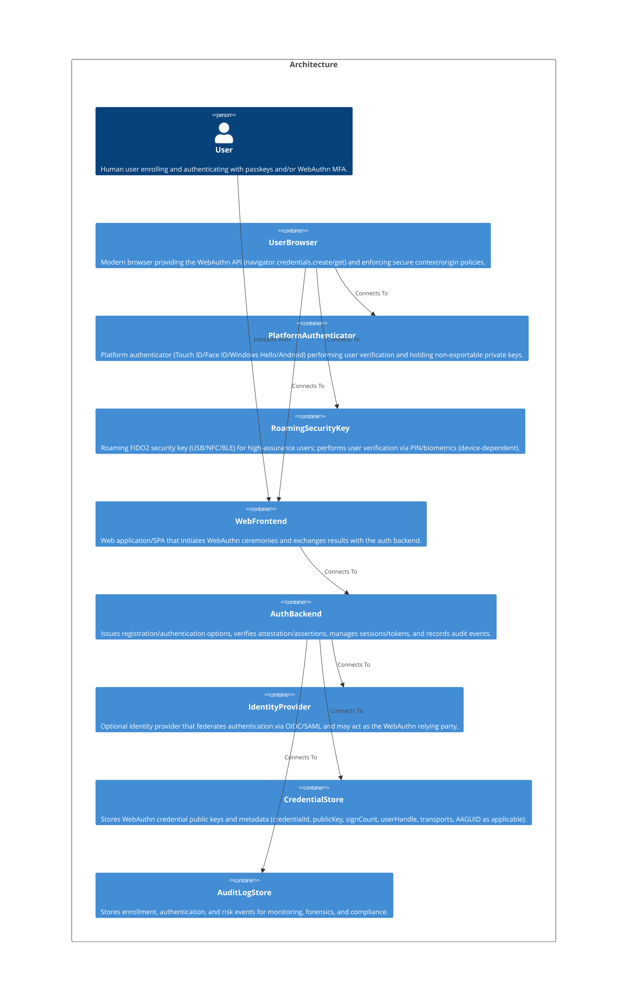

# Welcome to CALM Documentation

This documentation is generated from the **CALM Architecture-as-Code** model.

## High Level Architecture

## Nodes
    - [User](nodes/end-user)
    - [UserBrowser](nodes/user-browser)
    - [PlatformAuthenticator](nodes/platform-authenticator)
    - [RoamingSecurityKey](nodes/roaming-security-key)
    - [WebFrontend](nodes/web-frontend)
    - [AuthBackend](nodes/auth-backend)
    - [IdentityProvider](nodes/identity-provider)
    - [CredentialStore](nodes/credential-store)
    - [AuditLogStore](nodes/audit-log-store)

## Relationships
    - [User Browser To Web Frontend](relationships/user-browser-to-web-frontend)
    - [End User To Web Frontend](relationships/end-user-to-web-frontend)
    - [End User Uses Web Frontend](relationships/end-user-uses-web-frontend)
    - [Web Frontend To Auth Backend Registration Options](relationships/web-frontend-to-auth-backend-registration-options)
    - [User Browser To Platform Authenticator Registration](relationships/user-browser-to-platform-authenticator-registration)
    - [User Browser To Roaming Security Key Registration](relationships/user-browser-to-roaming-security-key-registration)
    - [Web Frontend To Auth Backend Registration Complete](relationships/web-frontend-to-auth-backend-registration-complete)
    - [Auth Backend Persists Credential](relationships/auth-backend-persists-credential)
    - [Auth Backend Writes Registration Audit](relationships/auth-backend-writes-registration-audit)
    - [Web Frontend To Auth Backend Authentication Options](relationships/web-frontend-to-auth-backend-authentication-options)
    - [User Browser To Platform Authenticator Authentication](relationships/user-browser-to-platform-authenticator-authentication)
    - [User Browser To Roaming Security Key Authentication](relationships/user-browser-to-roaming-security-key-authentication)
    - [Web Frontend To Auth Backend Authentication Complete](relationships/web-frontend-to-auth-backend-authentication-complete)
    - [Auth Backend Writes Authentication Audit](relationships/auth-backend-writes-authentication-audit)
    - [Auth Backend Federates To Idp](relationships/auth-backend-federates-to-idp)

## Flows
    - [WebAuthn Registration (Enrollment)](flows/webauthn-registration-flow)
    - [WebAuthn Authentication (Passwordless or MFA)](flows/webauthn-authentication-flow)

## Controls
| Requirement URL               | Category    | Scope        | Applied To                |
|-------------------------------|-----------|--------------|---------------------------|
|https://zeropass.example/requirements/client/secure-context|secure-context|Node|user-browser|
|https://zeropass.example/requirements/webauthn/key-protection|key-protection|Node|platform-authenticator|
|https://zeropass.example/requirements/webauthn/hardware-backed|hardware-backed-authenticator|Node|roaming-security-key|
|https://zeropass.example/requirements/transport/hsts|https-hsts|Node|web-frontend|
|https://zeropass.example/requirements/webauthn/origin-pinning|origin-pinning|Node|web-frontend|
|https://zeropass.example/requirements/webauthn/server-verification|webauthn-verification|Node|auth-backend|
|https://zeropass.example/requirements/security/abuse-prevention|abuse-prevention|Node|auth-backend|
|https://zeropass.example/requirements/federation/oidc-saml|federation-security|Node|identity-provider|
|https://zeropass.example/requirements/data/encryption|data-protection|Node|credential-store|
|https://zeropass.example/requirements/logging/tamper-evident|tamper-evident-logging|Node|audit-log-store|
|https://zeropass.example/requirements/transport/tls|tls-and-hsts|Relationship|user-browser-to-web-frontend|
|https://zeropass.example/requirements/transport/tls|tls-and-hsts|Relationship|end-user-to-web-frontend|
|https://zeropass.example/requirements/transport/tls|tls-and-hsts|Relationship|end-user-uses-web-frontend|
|https://zeropass.example/requirements/api/request-hardening|request-hardening|Relationship|web-frontend-to-auth-backend-registration-options|
|https://zeropass.example/requirements/webauthn/assertion-options|request-hardening|Relationship|web-frontend-to-auth-backend-authentication-options|
|https://zeropass.example/requirements/webauthn/user-verification|uv-required|Relationship|user-browser-to-platform-authenticator-registration|
|https://zeropass.example/requirements/webauthn/user-verification|uv-required|Relationship|user-browser-to-roaming-security-key-registration|
|https://zeropass.example/requirements/webauthn/user-verification|uv-required|Relationship|user-browser-to-platform-authenticator-authentication|
|https://zeropass.example/requirements/webauthn/user-verification|uv-required|Relationship|user-browser-to-roaming-security-key-authentication|
|https://zeropass.example/requirements/webauthn/attestation-validation|assertion-attestation-protection|Relationship|web-frontend-to-auth-backend-registration-complete|
|https://zeropass.example/requirements/data/protected-path|protected-data-path|Relationship|auth-backend-persists-credential|
|https://zeropass.example/requirements/logging/secure-ingest|audit-integrity|Relationship|auth-backend-writes-registration-audit|
|https://zeropass.example/requirements/logging/secure-ingest|audit-integrity|Relationship|auth-backend-writes-authentication-audit|
|https://zeropass.example/requirements/webauthn/assertion-validation|assertion-protection|Relationship|web-frontend-to-auth-backend-authentication-complete|
|https://zeropass.example/requirements/federation/secure|federation-controls|Relationship|auth-backend-federates-to-idp|
|https://zeropass.example/requirements/webauthn/registration-policy|registration-uv-required|Flow|webauthn-registration-flow|
|https://zeropass.example/requirements/webauthn/authentication-policy|authentication-uv-required|Flow|webauthn-authentication-flow|

## Metadata
  

      <table>
          <thead>
          <tr>
              <th>Key</th>
              <th>Value</th>
          </tr>
          </thead>
          <tbody>
          <tr>
              <td>
                  <b>Owner</b>
              </td>
              <td>
                  zeropass-team
                      </td>
          </tr>
          <tr>
              <td>
                  <b>Environment</b>
              </td>
              <td>
                  prod
                      </td>
          </tr>
          <tr>
              <td>
                  <b>Compliance</b>
              </td>
              <td>
                  <ul>
                      <li>WebAuthn</li>
                      <li>FIDO2</li>
                      <li>NIST-SP-800-63-4-AAL2</li>
                      <li>NIST-SP-800-63-4-AAL3</li>
                  </ul>
              </td>
          </tr>
          <tr>
              <td>
                  <b>Rp Id</b>
              </td>
              <td>
                  login.kv.com
                      </td>
          </tr>
          <tr>
              <td>
                  <b>Allowed Origins</b>
              </td>
              <td>
                  <ul>
                      <li>https://login.kv.com</li>
                  </ul>
              </td>
          </tr>
          <tr>
              <td>
                  <b>User Guidance</b>
              </td>
              <td>
                  

                      <table>
                          <thead>
                          <tr>
                              <th>Key</th>
                              <th>Value</th>
                          </tr>
                          </thead>
                          <tbody>
                          <tr>
                              <td>
                                  <b>Registration</b>
                              </td>
                              <td>
                                  From Settings → Security, choose ‘Add passkey’. Approve the prompt using Face ID/Touch ID/Windows Hello or a security key PIN. Registration completes when the device confirms user verification.
                                      </td>
                          </tr>
                          <tr>
                              <td>
                                  <b>Sign In</b>
                              </td>
                              <td>
                                  Enter your identifier (or complete primary sign-in for MFA), then approve the passkey prompt using biometrics/PIN. Do not approve prompts on unexpected domains; passkeys only work on the legitimate origin.
                                      </td>
                          </tr>
                          </tbody>
                      </table>
                  

              </td>
          </tr>
          <tr>
              <td>
                  <b>Adrs</b>
              </td>
              <td>
                  <ul>
                      <li>instructions/ADR-001.md</li>
                      <li>instructions/ADR-002.md</li>
                      <li>instructions/ADR-005.md</li>
                  </ul>
              </td>
          </tr>
          <tr>
              <td>
                  <b>Implementation Checklist</b>
              </td>
              <td>
                  <ul>
                      <li>Pin RP ID and allowed origins per environment</li>
                      <li>Use unique server-stored challenges with strict verification</li>
                      <li>Set userVerification&#x3D;required for registration and authentication</li>
                      <li>Store credential public keys and metadata securely linked to users</li>
                      <li>Capture enrollment/auth events and suspicious activity in audit logs</li>
                      <li>Rate-limit and segregate fallback factors (avoid SMS OTP as primary)</li>
                  </ul>
              </td>
          </tr>
          </tbody>
      </table>
  

## Adrs
  _No Adrs defined._
