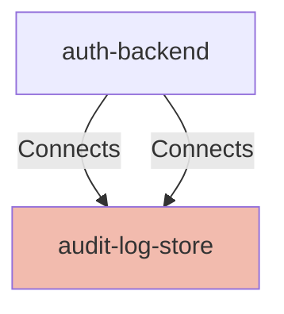

## Details

| Field               | Value                    |
|---------------------|--------------------------|
| **Unique ID**       | audit-log-store                   |
| **Node Type**       | database             |
| **Name**            | AuditLogStore                 |
| **Description**     | Stores enrollment, authentication, and risk events for monitoring, forensics, and compliance.          |

## Interfaces
        

            <table>
                <thead>
                <tr>
                    <th>Key</th>
                    <th>Value</th>
                </tr>
                </thead>
                <tbody>
                <tr>
                    <td>
                        <b>UniqueId</b>
                    </td>
                    <td>
                        audit-log-store-endpoint
                            </td>
                </tr>
                <tr>
                    <td>
                        <b>AdditionalProperties</b>
                    </td>
                    <td>
                        

                            <table>
                                <thead>
                                <tr>
                                    <th>Key</th>
                                    <th>Value</th>
                                </tr>
                                </thead>
                                <tbody>
                                <tr>
                                    <td>
                                        <b>Host</b>
                                    </td>
                                    <td>
                                        audit-log.internal
                                            </td>
                                </tr>
                                <tr>
                                    <td>
                                        <b>Port</b>
                                    </td>
                                    <td>
                                        443
                                            </td>
                                </tr>
                                </tbody>
                            </table>
                        

                    </td>
                </tr>
                </tbody>
            </table>
        

## Related Nodes

## Controls

        ### Tamper Evident Logging

        Audit logs are append-only and tamper-evident with restricted access.

        

            <table>
                <thead>
                <tr>
                    <th>Requirement URL</th>
                    <th>Config</th>
                </tr>
                </thead>
                <tbody>
                    <tr>
                        <td>
                                <a href="https://zeropass.example/requirements/logging/tamper-evident" target="_blank">
                                    https://zeropass.example/requirements/logging/tamper-evident
                                </a>
                        </td>

                        <td>
                                <table>
                                    <thead>
                                    <tr>
                                        <th>Key</th>
                                        <th>Value</th>
                                    </tr>
                                    </thead>
                                    <tbody>
                                        <tr>
                                            <td>appendOnly</td>
                                            <td>true</td>
                                        </tr>
                                        <tr>
                                            <td>tamperEvident</td>
                                            <td>true</td>
                                        </tr>
                                        <tr>
                                            <td>restrictedRead</td>
                                            <td>true</td>
                                        </tr>
                                        <tr>
                                            <td>retentionDays</td>
                                            <td>365</td>
                                        </tr>
                                    </tbody>
                                </table>

                        </td>
                    </tr>
                </tbody>
            </table>
        

## Metadata
  

      <table>
          <thead>
          <tr>
              <th>Key</th>
              <th>Value</th>
          </tr>
          </thead>
          <tbody>
          <tr>
              <td>
                  <b>Owner</b>
              </td>
              <td>
                  security-team
                      </td>
          </tr>
          <tr>
              <td>
                  <b>Environment</b>
              </td>
              <td>
                  prod
                      </td>
          </tr>
          <tr>
              <td>
                  <b>Compliance</b>
              </td>
              <td>
                  <ul>
                      <li>SOC2</li>
                      <li>ISO-27001</li>
                  </ul>
              </td>
          </tr>
          </tbody>
      </table>
  

