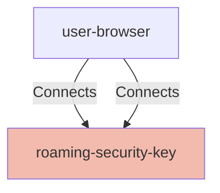

## Details

| Field               | Value                    |
|---------------------|--------------------------|
| **Unique ID**       | roaming-security-key                   |
| **Node Type**       | system             |
| **Name**            | RoamingSecurityKey                 |
| **Description**     | Roaming FIDO2 security key (USB/NFC/BLE) for high-assurance users; performs user verification via PIN/biometrics (device-dependent).          |

## Interfaces
        

            <table>
                <thead>
                <tr>
                    <th>Key</th>
                    <th>Value</th>
                </tr>
                </thead>
                <tbody>
                <tr>
                    <td>
                        <b>UniqueId</b>
                    </td>
                    <td>
                        roaming-security-key-uv
                            </td>
                </tr>
                <tr>
                    <td>
                        <b>AdditionalProperties</b>
                    </td>
                    <td>
                        

                            <table>
                                <thead>
                                <tr>
                                    <th>Key</th>
                                    <th>Value</th>
                                </tr>
                                </thead>
                                <tbody>
                                <tr>
                                    <td>
                                        <b>Capability</b>
                                    </td>
                                    <td>
                                        user-verification
                                            </td>
                                </tr>
                                <tr>
                                    <td>
                                        <b>Methods</b>
                                    </td>
                                    <td>
                                        <ul>
                                            <li>pin</li>
                                            <li>biometric-if-supported</li>
                                        </ul>
                                    </td>
                                </tr>
                                </tbody>
                            </table>
                        

                    </td>
                </tr>
                </tbody>
            </table>
        

## Related Nodes

## Controls

        ### Hardware Backed Authenticator

        Hardware-backed authenticator for higher assurance populations.

        

            <table>
                <thead>
                <tr>
                    <th>Requirement URL</th>
                    <th>Config</th>
                </tr>
                </thead>
                <tbody>
                    <tr>
                        <td>
                                <a href="https://zeropass.example/requirements/webauthn/hardware-backed" target="_blank">
                                    https://zeropass.example/requirements/webauthn/hardware-backed
                                </a>
                        </td>

                        <td>
                                <table>
                                    <thead>
                                    <tr>
                                        <th>Key</th>
                                        <th>Value</th>
                                    </tr>
                                    </thead>
                                    <tbody>
                                        <tr>
                                            <td>privateKeyExportable</td>
                                            <td>false</td>
                                        </tr>
                                        <tr>
                                            <td>hardwareBacked</td>
                                            <td>true</td>
                                        </tr>
                                        <tr>
                                            <td>userVerification</td>
                                            <td>required</td>
                                        </tr>
                                    </tbody>
                                </table>

                        </td>
                    </tr>
                </tbody>
            </table>
        

## Metadata
  

      <table>
          <thead>
          <tr>
              <th>Key</th>
              <th>Value</th>
          </tr>
          </thead>
          <tbody>
          <tr>
              <td>
                  <b>Owner</b>
              </td>
              <td>
                  end-user
                      </td>
          </tr>
          <tr>
              <td>
                  <b>Environment</b>
              </td>
              <td>
                  prod
                      </td>
          </tr>
          <tr>
              <td>
                  <b>Compliance</b>
              </td>
              <td>
                  <ul>
                      <li>FIDO2</li>
                      <li>WebAuthn</li>
                      <li>NIST-SP-800-63-4</li>
                  </ul>
              </td>
          </tr>
          </tbody>
      </table>
  

